## Salesync Backend
### 디렉터리 구조
<details>
<summary>디렉터리 구조</summary>
<div markdown="1">

```
📦backend
 ┣ 📂.github
 ┃ ┣ 📂ISSUE_TEMPLATE
 ┃ ┃ ┣ 📜✅-feature-request.md
 ┃ ┃ ┗ 📜🐞-bug-report.md
 ┃ ┣ 📂workflows
 ┃ ┃ ┣ 📜bff.yaml
 ┃ ┃ ┣ 📜consulting-service.yml
 ┃ ┃ ┣ 📜dash-service.yml
 ┃ ┃ ┣ 📜desc.txt
 ┃ ┃ ┣ 📜item-service.yml
 ┃ ┃ ┣ 📜models.yml
 ┃ ┃ ┣ 📜order-service.yml
 ┃ ┃ ┣ 📜sale-service.yml
 ┃ ┃ ┗ 📜store-service.yml
 ┃ ┣ 📜CODEOWNERS
 ┃ ┗ 📜PULL_REQUEST_TEMPLATE
 ┣ 📂bff
 ┃ ┣ 📂app
 ┃ ┃ ┣ 📂api
 ┃ ┃ ┃ ┣ 📜__init__.py
 ┃ ┃ ┃ ┣ 📜bff.py
 ┃ ┃ ┃ ┗ 📜main.py
 ┃ ┃ ┗ 📜__init__.py
 ┃ ┣ 📂config
 ┃ ┃ ┣ 📜__init__.py
 ┃ ┃ ┗ 📜development.py
 ┃ ┗ 📜requirements.txt
 ┣ 📂consulting_service
 ┃ ┣ 📂app
 ┃ ┃ ┣ 📂api
 ┃ ┃ ┃ ┣ 📜__init__.py
 ┃ ┃ ┃ ┣ 📜consulting.py
 ┃ ┃ ┃ ┗ 📜main.py
 ┃ ┃ ┣ 📂kafka
 ┃ ┃ ┃ ┣ 📜__init__.py
 ┃ ┃ ┃ ┣ 📜consumer.py
 ┃ ┃ ┃ ┗ 📜producer.py
 ┃ ┃ ┣ 📜__init__.py
 ┃ ┃ ┗ 📜models.py
 ┃ ┣ 📂config
 ┃ ┃ ┣ 📜__init__.py
 ┃ ┃ ┗ 📜development.py
 ┃ ┣ 📜__init__.py
 ┃ ┣ 📜app.sh
 ┃ ┗ 📜requirements.txt
 ┣ 📂dashboard_service
 ┃ ┣ 📂app
 ┃ ┃ ┣ 📂api
 ┃ ┃ ┃ ┣ 📜__init__.py
 ┃ ┃ ┃ ┣ 📜dashboard.py
 ┃ ┃ ┃ ┗ 📜main.py
 ┃ ┃ ┣ 📂kafka
 ┃ ┃ ┃ ┣ 📜__init__.py
 ┃ ┃ ┃ ┣ 📜consumer.py
 ┃ ┃ ┃ ┗ 📜producer.py
 ┃ ┃ ┗ 📜__init__.py
 ┃ ┣ 📂config
 ┃ ┃ ┣ 📜__init__.py
 ┃ ┃ ┗ 📜development.py
 ┃ ┣ 📜__init__.py
 ┃ ┗ 📜requirements.txt
 ┣ 📂item_service
 ┃ ┣ 📂app
 ┃ ┃ ┣ 📂api
 ┃ ┃ ┃ ┣ 📜__init__.py
 ┃ ┃ ┃ ┣ 📜categories.py
 ┃ ┃ ┃ ┣ 📜items.py
 ┃ ┃ ┃ ┗ 📜main.py
 ┃ ┃ ┣ 📜__init__.py
 ┃ ┃ ┗ 📜models.py
 ┃ ┣ 📂config
 ┃ ┃ ┣ 📜__init__.py
 ┃ ┃ ┣ 📜development.py
 ┃ ┃ ┗ 📜production.py
 ┃ ┣ 📜__init__.py
 ┃ ┣ 📜app.sh
 ┃ ┗ 📜requirements.txt
 ┣ 📂order_service
 ┃ ┣ 📂app
 ┃ ┃ ┣ 📂api
 ┃ ┃ ┃ ┣ 📜__init__.py
 ┃ ┃ ┃ ┣ 📜main.py
 ┃ ┃ ┃ ┗ 📜orders.py
 ┃ ┃ ┣ 📜__init__.py
 ┃ ┃ ┗ 📜models.py
 ┃ ┣ 📂config
 ┃ ┃ ┣ 📜__init__.py
 ┃ ┃ ┣ 📜development.py
 ┃ ┃ ┗ 📜production.py
 ┃ ┣ 📜__init__.py
 ┃ ┣ 📜app.sh
 ┃ ┗ 📜requirements.txt
 ┣ 📂sale_service
 ┃ ┣ 📂app
 ┃ ┃ ┣ 📂api
 ┃ ┃ ┃ ┣ 📜__init__.py
 ┃ ┃ ┃ ┣ 📜main.py
 ┃ ┃ ┃ ┗ 📜sales.py
 ┃ ┃ ┣ 📜__init__.py
 ┃ ┃ ┗ 📜models.py
 ┃ ┣ 📂config
 ┃ ┃ ┣ 📜__init__.py
 ┃ ┃ ┣ 📜development.py
 ┃ ┃ ┗ 📜production.py
 ┃ ┣ 📜__init__.py
 ┃ ┣ 📜app.sh
 ┃ ┗ 📜requirements.txt
 ┣ 📂store_service
 ┃ ┣ 📂app
 ┃ ┃ ┣ 📂api
 ┃ ┃ ┃ ┣ 📜__init__.py
 ┃ ┃ ┃ ┣ 📜main.py
 ┃ ┃ ┃ ┗ 📜stores.py
 ┃ ┃ ┣ 📜__init__.py
 ┃ ┃ ┗ 📜models.py
 ┃ ┣ 📂config
 ┃ ┃ ┣ 📜__init__.py
 ┃ ┃ ┣ 📜development.py
 ┃ ┃ ┗ 📜production.py
 ┃ ┣ 📂test
 ┃ ┃ ┣ 📜fixtures.py
 ┃ ┃ ┣ 📜hook.py
 ┃ ┃ ┗ 📜test_api.py
 ┃ ┣ 📜__init__.py
 ┃ ┣ 📜app.sh
 ┃ ┗ 📜requirements.txt
 ┣ 📜.gitignore
 ┣ 📜Dockerfile-bff
 ┣ 📜Dockerfile-consulting
 ┣ 📜Dockerfile-dash
 ┣ 📜Dockerfile-item
 ┣ 📜Dockerfile-order
 ┣ 📜Dockerfile-sale
 ┣ 📜Dockerfile-store
 ┣ 📜README.md
 ┗ 📜__init__.py
```

</details>

- .github: GitHub 워크플로우 및 현업 컨벤션
- *_service: 서비스 단위로 논리적으로 분리
    - /app/api: 서버 코드
    - /app/models.py: orm 모델
    - /app/config: config 파일
    - /app/kafka: kafka 설정
        - producer, consumer 및 필요 함수 정의
    - app.sh: 빌드 시 실행 파일
- Dockerfile-*: 해당 서비스 Dockerfile

## 기술 스택


## 모노레포
MSA 아키텍처 서비스를 하나의 레포에서 관리한다.
각 서비스별 폴더에서 작업 후 변경 사항이 감지되는 경우 자동 build후 ECR에 태그 변경한다. 변경된 태그를 ArgoCD가 감지한 후 각 service와 deploy로 배포한다.
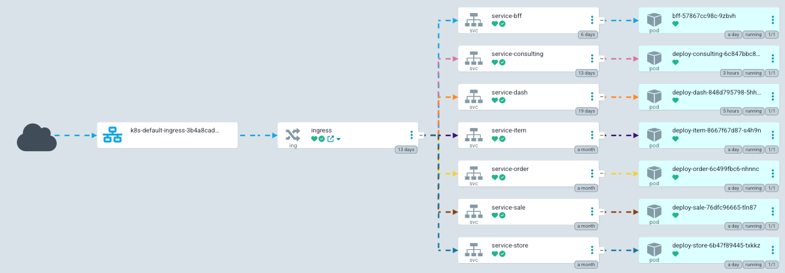

## Services
### Store Service

- 로그인
- 회원 가입 및 매장 정보 등륵
- 매장 정보 조회 및 수정
- 로그인 시 JWT 토큰 발급

<details>
<summary> Store 서비스 API 명세서</summary>
<div markdown="1">
    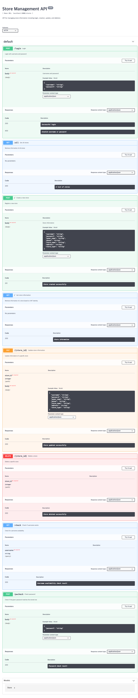
</div>
</details>

### Item Service
- 카테고리 및 아이템 등록
- 카테고리 및 아이템 조회
- 카테고리 및 아이템 수정
- 카테고리 및 아이템 삭제

<details>
<summary> Item 서비스 API 명세서</summary>
<div markdown="1">
    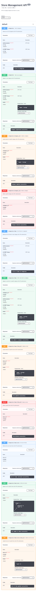
</div>
</details>

### Order Service
- 주문 등록 및 수정
- 미결제 테이블 조회
- 주문 전체 취소
- 일별 혹은 기간별 주문량 조회
- Item 서비스와 내부 통신

<details>
<summary> Order 서비스 API 명세서</summary>
<div markdown="1">
    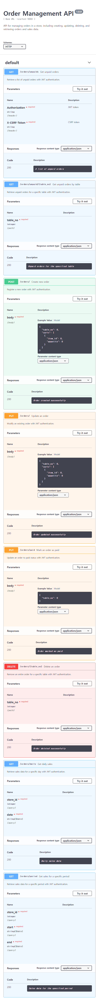
</div>
</details>

### Sale Service
- 전체 매출 조회
- 일별 및 기간별 매출 조회
- Order 서비스와 내부 통신

<details>
<summary> Sale 서비스 API 명세서</summary>
<div markdown="1">
    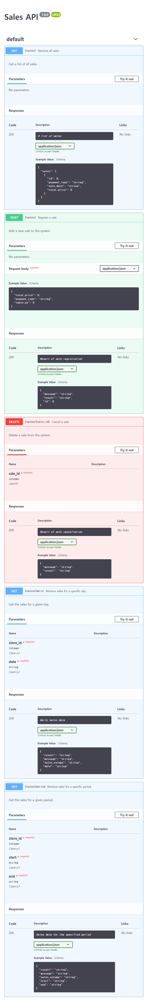
</div>
</details>

### Dashboard Service
- 아이템 원가 입력 및 수정
- 기간별 전체 매출 및 순이익 조회
- 컨설팅 조회
- Sale, Order, Item 서비스와 내부 통신
- Consulting 서비스의 Kafka Producer가 송신한 이벤트 수신하는 Kafka Consumer
- 하루 매출 정산 문자 전송

<details>
<summary> Dashboard 서비스 API 명세서</summary>
<div markdown="1">
    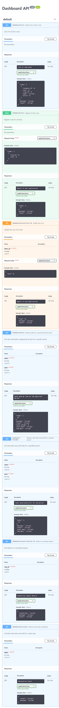
</div>
</details>

### Consulting Service
- 컨설팅
- Dashboard 서비스와 내부 통신
- 비동기 처리 후 결과값 이벤트 버스로 송신하는 Kafka Producer
- OpenAI API 사용을 위한 비동기 실행

<details>
<summary> Consulting 서비스 API 명세서</summary>
<div markdown="1">
    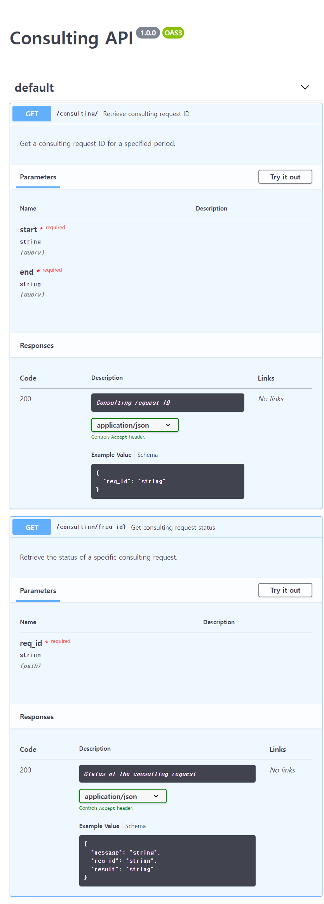
</div>
</details>

## Database ERD
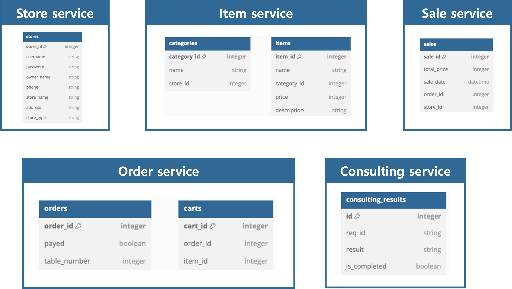
각 서비스의 데이터베이스는 논리적으로 분리되어 있어, 다른 서비스의 데이터가 필요한 경우 내부 통신을 통해 이용한다.

## Kubernetes 내부 API 통신
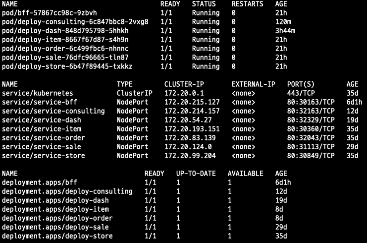
kubernetes 내부에서 다른 서비스의 pod에 접근하기 위해서는 "<service>.<namespace>.svc.cluster.local"주소로 접근해야한다.

예시
```
http://service-item.default.svc.cluster.local
```

## Kafka 비동기 이벤트 처리
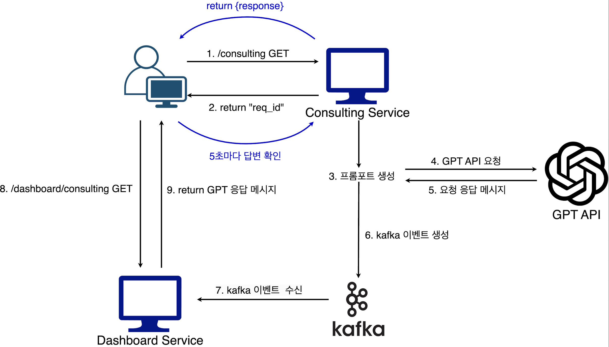
사용자가 Consulting 서비스로 요청을 보내면 즉시 req_id를 반환한 후 비동기로 GPT API를 호출한다. GPT API가 반환한 값을 받아 producer가 이벤트를 생성하면 Dashboard 서비스의 consumer가 수신할 수 있는 구조이다.
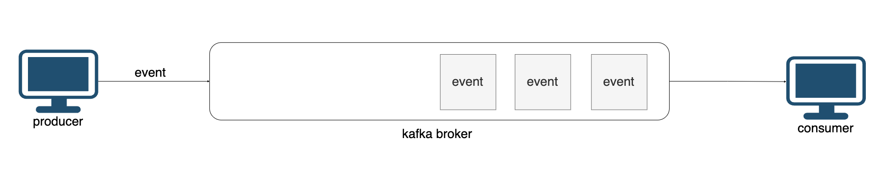
각각의 producer와 consumer은 consulting 토픽으로 이벤트를 송수신한다.

consumer에서는 메시지를 받을 때, 파라미터로 받은 req_id에 해당하는 메시지를 서칭하여 반환해준다.

## Amazon SNS 이용한 문자 전송
정산하기 버튼 클릭시 해당하는 매장의 하루 매출 정보를 문자로 전송한다.
- 서울 리전에서는 Amazon SNS 메시지 서비스가 안되어 도쿄 리전에서 사용
- 샌드 박스 해제 시 모든 번호로 문자 전송 가능<br>
    -> 현재 서비스에서 더미 데이터가 많아 샌드 박스 해제 대신 특정 번호로만 전송되도록 하였다.

## Trouble Shooting
1. /dashboards/volumes GET 성능 50%이상 향상
2. /orders/ POST, PUT request body의 cart에 빈배열인 경우 주문 등록 혹은 수정 실패
=> 빈 배열인 경우 기존 주문을 삭제하도록 수정
3. Database 분리 시 서비스간 존재하지 않는 값 입력<br>
예) store 서비스에서 10번 스토에 해당하는 정보가 없는데, Item 서비스에 데이터가 입력되는 경우
=> 참조 관계를 명확히하여 조회 후 등록될 수 있도록 수정 
4. OpenAI sercret key 이슈
-> 초기 secret key 값이 환경 변수로 지정되지 않아 계속 Consulting pod CrashLoopBackError 발생
=> key 관리를 위해 secret key로 key를 등록한 후 build 시 arg로 시크릿값을 받아온 후 환경변수로 설정
5. EFK 스택 이용한 로그 수집 중 부하 발생
-> 로그 수집 시 fluentd conf 파일 문제로 모든 공백을 수집하여 노드 부하 발생


=> deploy_*default_*.log의 형식을 가진 로그만 수집해오도록 수정 후 해결